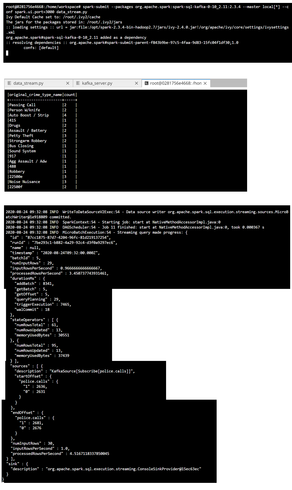

# UDACITY Data Streaming Nanodegree - Project 2
## SF Crime Statistics with Spark Strctured Streaming

### Project Overview
In this project, you will be provided with a real-world dataset, extracted from Kaggle, on San Francisco crime incidents, and you will provide statistical analyses of the data using Apache Spark Structured Streaming. You will draw on the skills and knowledge you've learned in this course to create a Kafka server to produce data, and ingest data through Spark Structured Streaming.

#### Environment
- Spark 2.4.3
- Scala 2.11.x
- Java 1.8.x
- Kafka build with Scala 2.11.x
- Python 3.6.x or 3.7.x

To provide a statistical analysis of the data using Apache Spark Structured Streaming based on the couple of Kaggle datasets. This project demostrates one's Kafka and spark integration skills. 

## Implementation steps

### Linux Commands:
All the Linux terminal commands used in this project are available in the file **commands.txt**.

### Step-1: Create a Kafka producer

- Edit the `server.properties` config file to use 9099 port for the Kafka cluster. 
- Using `zookeeper-server-start` utitlity start the zookeeper server at CLI
- Using `kafka-server-start` utility start the kafka cluster
- Execute `./start.sh` command at CLI
- Complete the logic in `producer_server.py` and `kafka_server.py`to create a Kafka producer
    - `police.calls` is the topic name used during the configuration
    - `9099` is the port used for Kafka cluster during the configuration
- Execute `python kafka_server.py` at the CLI. 
- Run `kafka-console-consumer --topic police.calls --bootstrap-server localhost:9099 --from-beginning` command from linux terminal and capture the output generated at the console

    
    
### Step-2: Consume the Kafka generated data using Spark Structured streaming

- Create a `readstream` and ingest the date from Kafka topic `police.calls`
- Find the number of occurences of `original_crime_type_name`
- Create `writestream` by writing the aggregated output in the console
- Capture the output generated at the console

    
        
- Launch the Spark CLI by clicking the **Preview** button in the Udacity workspace.

    
    

### Answers to questions

1. How did changing values on the SparkSession property parameters affect the throughput and latency of the data?
    
    - more the `processedRowsPerSecond` higher the throughput

2. What were the 2-3 most efficient SparkSession property key/value pairs? Through testing multiple variations on values, how can you tell these were the most optimal?

    - `numInputRows` : The aggregate (across all sources) number of records processed in a trigger.
    - `inputRowsPerSecond` : The aggregate (across all sources) rate of data arriving.
    - `processedRowsPerSecond` : The aggregate (across all sources) rate at which Spark is processing data.
	-  Spark.sql.shuffle.partitions: In spark, shuffle operations are expensive, which is why parallelising is crucial for high traffic apps.
	
